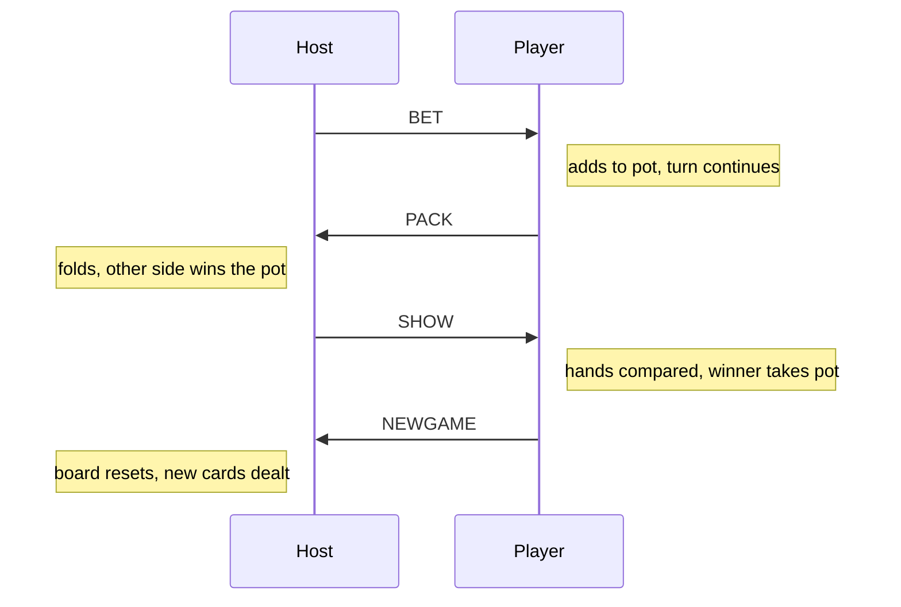
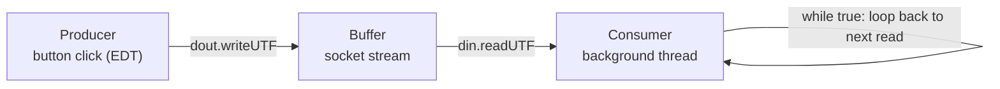

# Teen Patti LAN Card Game (Java Swing)

A 2-player networked Teen Patti (3-card Indian poker) game. One player **Hosts** (runs a `ServerSocket` on port `6666`), the other **Joins** with the host's IP. Once connected, both sides play through `HostGame` / `PlayerGame` Swing frames, exchanging moves (`BET`, `PACK`, `SHOW`, `NEWGAME`) over a plain `Socket`.

## Flow

1. `Test1` — entry screen: enter name, then **Host** or **Join**.
2. `MakeHost()` opens a `ServerSocket(6666)` and blocks on `ss.accept()`. `MakeJoin()` connects to the given IP.
3. Once connected, both sides trade the first message (host's name) via `DataInputStream`/`DataOutputStream`.
4. Host clicks **Play** → sends `"S"` → both sides launch their game window (`HostGame`, `PlayerGame`).

## How the threading works

Each game window (Host and Player) has **one background thread** that loops forever, blocked on `din.readUTF()`. It only wakes up when data arrives over the socket. Meanwhile, the **button clicks run on the Swing Event Dispatch Thread** and send data with `dout.writeUTF(...)`. So sending and receiving never block each other.

**All the message types**, in order of a typical round. Either side can send any of these — whoever's turn it is:



**The thread mechanics** behind every one of those arrows are just a producer/consumer pair: a button click *produces* a message onto the socket, and a background thread *consumes* it by blocking on a read until something shows up.




## Sending a move (button click, e.g. BET)

```java
btnbet.addActionListener(new ActionListener() {
    public void actionPerformed(ActionEvent e) {
        YourBalanceValue -= CurrentBitValue;
        PoolBalanceValue += CurrentBitValue;
        try {
            String actionPayload = Utility.packData(
                YourBalanceValue, PoolBalanceValue, OppositeBalanceValue,
                CurrentBitValue, Increment, false, allcards, allcards,
                isVisibleCards, 0, isSeen, "BET", "");
            dout.writeUTF(actionPayload);   // <-- goes straight over the socket
        } catch (Exception ex3) { }
        th.notify();
    }
});
```

## Receiving a move (background thread, continuously listening)

```java
th = new Thread(new Runnable() {
    public void run() {
        while (true) {
            try {
                this.wait();                         // sleeps until notified
            } catch (Exception ex6) { }

            String actionPayload = din.readUTF();     // <-- blocks here until data arrives
            String[] data = Utility.unpackData(actionPayload);

            action = data[11];   // "BET" / "PACK" / "SHOW" / "NEWGAME"
            result = data[12];

            switch (action) {
                case "BET":  /* update UI */ break;
                case "PACK": /* opponent folded, you win */ break;
                case "SHOW": /* compare hands, show dialog */ break;
                case "NEWGAME": /* reset board for next round */ break;
            }
        }
    }
});
th.start();
```

`Utility.packData(...)` flattens all game state (balances, pot, bet, card array, action, result) into one comma-separated string so it can travel as a single `writeUTF` call; `Utility.unpackData(...)` splits it back into fields on the other end.

## Files

| Class | Role |
|---|---|
| `Test1` | Entry screen + socket setup (Host/Join) |
| `HostGame` / `PlayerGame` | Game window + listener thread for each side |
| `Utility` | Pack/unpack network payloads, hand comparison, dialogs |
| `card_game` | Legacy hand-ranking helper (console-based) |
